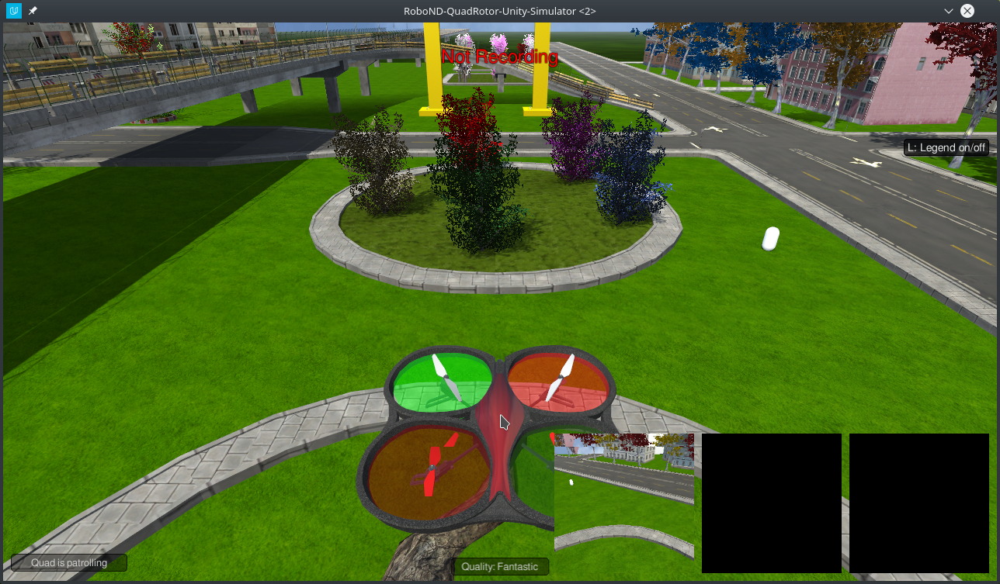
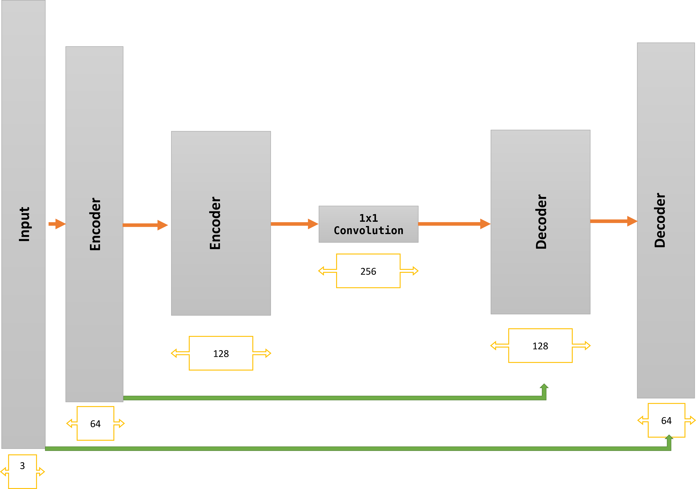
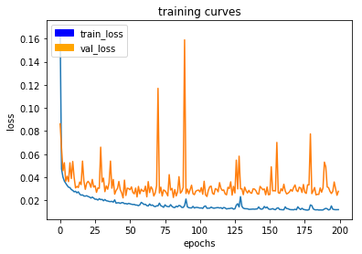
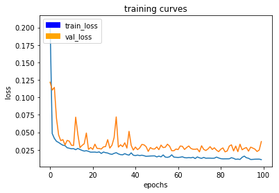
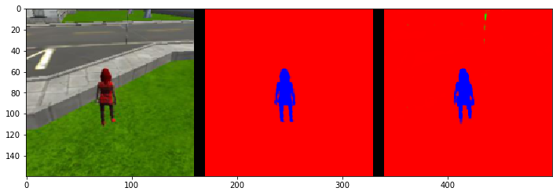
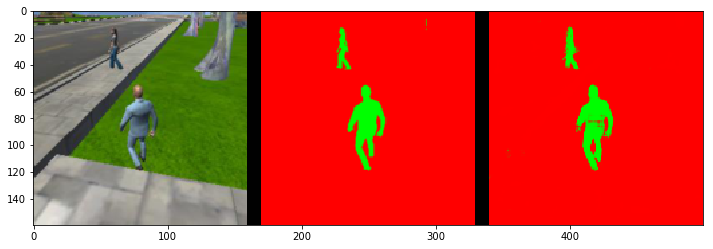
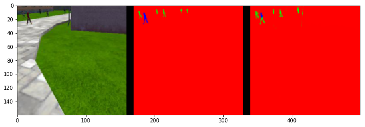

# Follow Me Project 



In this project, a deep neural network will be trained to identify and track a **target** in simulation. 

* Weights File: [Weights](weights/model_weights) 
* Weights Confg [weights confg](weights/config_model_weights) 
* A HTML version of : [model_training.ipynb notebook](model_training.html)  
* Notebook: [model_training.ipynb](code/model_training.ipynb)   

In This Project i used the Data, that already collected to train FCN (Fully Convolutional Neural Network) to identify a Target From a Drone 

###Generally FCN contains :

* Encoder Block 
* 1X1 Convolution
* Decoder Block 

The Encoder Block and Decoder Block are made of **Separable convolutions**  

> Separable convolutions, also known as depthwise separable convolutions, comprise of a convolution performed over each channel of an input layer and followed by a 1x1 convolution that takes the output channels from the previous step and then combines them into an output layer.

>This is different than regular convolutions , mainly because of the reduction in the number of parameters. Let's consider a simple example.  
>*Class Room*

## Auxiliary functions :
*separable_conv2d_batchnorm()* takes input layer and number of Filters and return a Separable Convolution with **ReLU** and  **Batch normalization** 

```python
def separable_conv2d_batchnorm(input_layer, filters, strides=1):
    output_layer = SeparableConv2DKeras(filters=filters,kernel_size=3, strides=strides,
                             padding='same', activation='relu')(input_layer)
    
    output_layer = layers.BatchNormalization()(output_layer) 
    return output_layer
```
*conv2d_batchnorm()* takes input layer and number of Filters and kernel_size and return a Regular Convolution with **ReLU** and  **Batch normalization** 

```python
def conv2d_batchnorm(input_layer, filters, kernel_size=3, strides=1):
    output_layer = layers.Conv2D(filters=filters, kernel_size=kernel_size, strides=strides, 
                      padding='same', activation='relu')(input_layer)
    
    output_layer = layers.BatchNormalization()(output_layer) 
    return output_layer

```
for the **Decoder Block** wen need Upsample Function

```python
def bilinear_upsample(input_layer):
    output_layer = BilinearUpSampling2D((2,2))(input_layer)
    return output_layer
```

## Model :
#### Encoder Block :
is built of Separable Convolution 
#### 1X1 Convolution :
1X1 Convolution using *conv2d_batchnorm()*
#### Decoder Block :
* A bilinear upsampling layer.
* A layer concatenation step. This step is similar to skip connections.  concatenate the upsampled layer and the large layer.
* Some (one or two) additional separable convolution layers to extract some more spatial information from prior layers.

with each encoder layer, the depth of the model (the number of filters) increases.
I Used two Encoder Blocks with Depth 64,128 respectively with 1X1 Convolution with a depth of 256 

My Model consists of two encoder and two decoder and 1X1 Convolution




## Training and Hyperparameters

### Steps per Epoch :
The default Dataset contains 4131 Files with batch size of 32 so is the Number of Steps per Epoch 130

### Number of Epochs :
200 led to overfitting :



100 was good 



### Learning rate :
#### Learning rate 0.1:
* loss: 0.0205
* val_loss: 0.0268
* final_score: 0.367229903911

#### Learning rate 0.01:
* loss: 0.0175
* val_loss: 0.0249
* final_score: 0.403661134044

#### Learning rate 0.005
* loss: 0.0111
* val_loss: 0.0368
* final_score: 0.428174168283


## Prediction :



